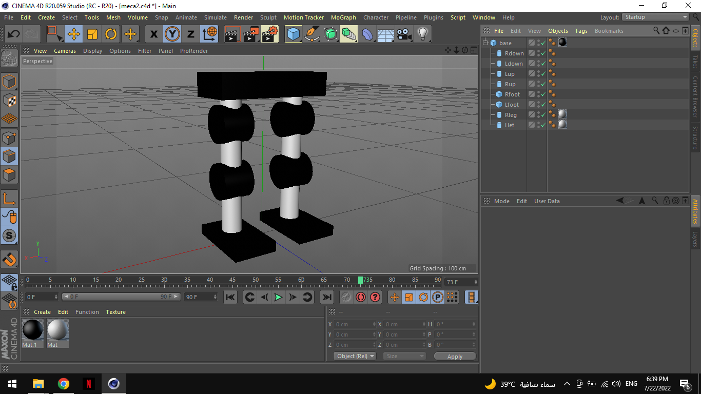

# Mech-Eng-Task-1-2

Task 1: Designing the initial robot legs stick model..

Task 2: Calculating the maximum degree of rotation for the robot foot movement..

## Table of Contents
* [Task 1: Robot legs stick model](#1)
* [Task 2: Maximum degree of rotation for the robot foot movement](#2)

## Task 1: Robot legs stick model
The initial robot legs stick model was designed using Cinema 4D.

### The model parts heights::
- Model Height: 64 cm.
- Base Height: 9 cm.
- Legs: 51 cm.
- Feet: 4 cm.

### Technologies Used
- 3D design software.

### Resources
- [https://www.youtube.com/watch?v=wo-Pl1orllQ&list=LL&index=2]

## Task 2: Maximum degree of rotation for the robot foot movement

The calculation done by using the rule bellow:

`Theta = tan^-1 * (adjacent /  opposite)`

## Participated in the Task: 
- Abdulwahab Dhifallah [@Elechop](https://github.com/Elechop)

